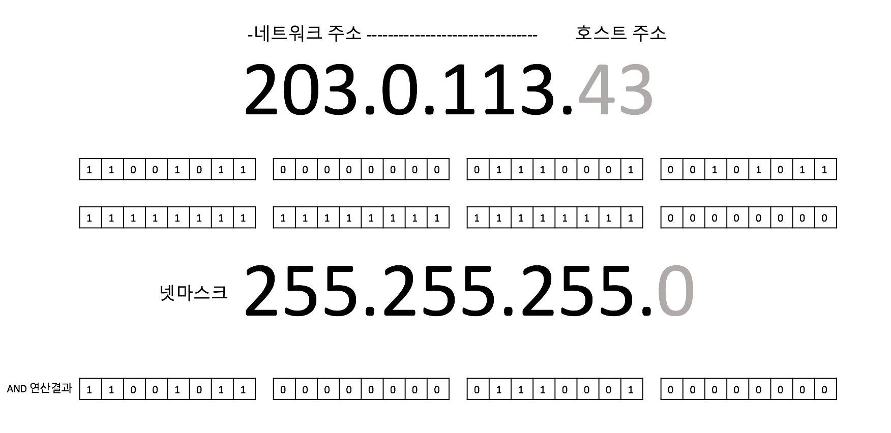
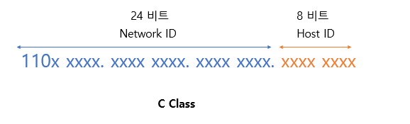
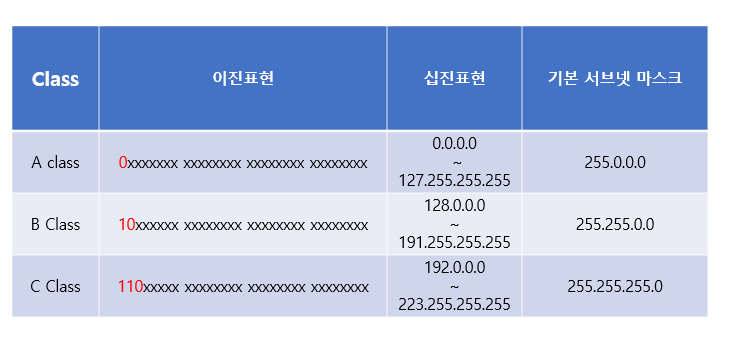
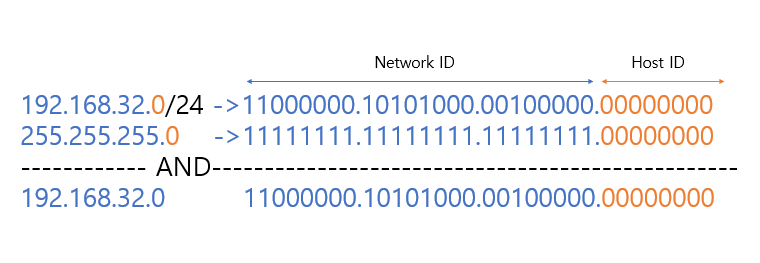

# 서브넷마스크
## 넷마스크 (Netmask)
> 네트워크 주소 부분의 비트를 1로 치환한 것

- IP 주소와 넷마스크를 AND 연산하면 네트워크 주소를 얻을 수 있다.

## 서브넷마스크 (Subnet Mask)

### 서브넷 (Subnet)
> IP 주소에서 네트워크 영역을 부분적으로 나눈 부분 네트워크를 뜻함 
- 이러한 서브넷을 만들 때 사용되는 것이 바로 서브넷 마스크이다. 
- 즉, 서브넷 마스크는 IP 주소 체계의 Network ID와 Host ID를 분리하는 역할을 한다. 

- 예를 들어, C 클래스는 기본적으로 앞의 24비트는 Network ID, 뒤의 8비트는 Host ID를 나타낸다. 
- 이 때, 서브넷 마스크를 이용하면 원본 네트워크를 여러 개의 네트워크로 분리할 수 있다. 이러한 과정을 서브넷팅(subneting)이라고 한다.

### 기본 서브넷 마스크 (Default Subnet Mask)

- 각 클래스마다 기본 서브넷 마스크는 위 표와 같다. (D, E클래스는 사용하지 않음). 
- 이러한 기본 서브넷 마스크를 이용하면 IP 주소의 Network ID와 Host ID를 구분할 수 있다. IP 주소에 서브넷 마스크를 AND 연산하면 Network ID가 된다.

### 기본 서브넷 마스크의 이용

 
- 예를 들어 C클래스인 192.168.32.0 이라는 IP주소가 있다고 하자. C클래스의 기본 서브넷 마스크는 255.255.255.0 이므로 AND연산을 하면 192.168.32.0이 나오고 이것이 바로 Network ID이다. 
- 이 때, 서브넷 마스크의 Network ID부분은 1이 연속적으로 있어야 하고 Host ID부분은 0이 연속적으로 있어야 한다.
- 예시의 IP 주소를 보면 192.168.32.0/24 처럼 /24 같은 표시가 붙어있는 것을 확인할 수 있다. 
- 이것은 서브넷 마스크의 bit 수(왼쪽에서부터 1의 개수)를 나타낸다. 즉 /24는 해당 IP의 서브넷 마스크의 왼쪽에서부터 24개가 1이라는 것을 의미한다. 
