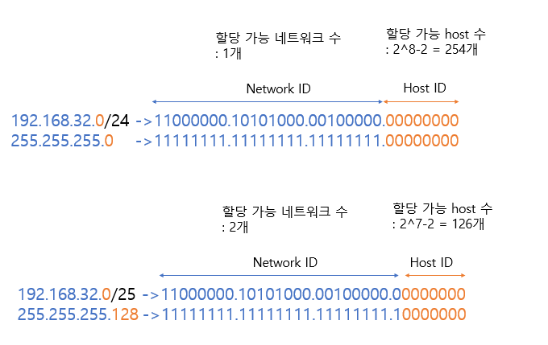
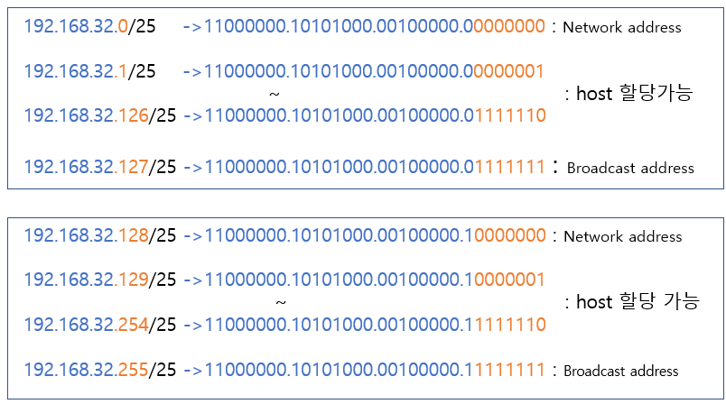

# 서브넷팅 (Subnetting)
> IP 주소 낭비를 방지하기 위해 원본 네트워크를 여러 개의 서브넷으로 분리하는 과정
- 서브넷 마스크의 bit 수를 증가시키는 것이라고 생각하면 이해가 편하다. 서브넷 마스크의 bit 수를 1씩 증가시키면 할당할 수 있는 네트워크가 2배수로 증가하고 호스트 수는 2배수로 감소한다.

## 서브넷팅 예시
- 예를 들어 C클래스인 192.168.32.0/24를 서브넷 마스크의 bit수를 1 증가시켜서 192.168.32.0/25로 변경한다고 하자.

- 192.168.32.0/24는 원래 하나의 네트워크였다. 이때 할당 가능한 host의 수는 2^8-2=254개이다.
- 여기서 2개를 빼는 이유는 첫번째 주소인 192.168.32.0은 Network Address로 쓰이고 마지막 주소인 192.168.32.255는 Broadcast로 쓰이기 때문에 호스트에 할당할 수 없기 때문이다. 
- 이 때 서브넷 마스크의 bit 수를 1 증가시켜서(서브넷팅) 192.168.32.0/25로 변경하게 되면, Network ID 부분을 나타내는 부분이 24비트에서 25비트로 증가하고 Host ID를 나타내는 부분이 8개 비트에서 7개 비트로 줄어든다. 
- 즉 할당 가능한 네트워크 수가 2배로 증가하고 각 네트워크(서브넷)당 할당 가능한 호스트 수는 2^7-2 = 126개로 줄어든다. 또한 서브넷 마스크가 255.255.255.128로 변한 것을 확인할 수 있다. 

## 서브넷팅 구성

## 서브넷팅 예제 문제

### P1) 211.100.10.0/24 네트워크를 각 서브넷당 55개의 Host를 할당할 수 있도록 서브넷팅 한다고 하자.

#### a) 서브넷 마스크를 구하시오.
풀이 : Host ID 비트를 생각하면 쉽다. Host ID를 나타내는 비트가 6개라면 2^6-2=62개의 호스트를 할당할 수 있으므로 충분하다. 그렇다면 32개의 비트 중 26개가 서브넷 마스크의 bit개수이므로 1111111.11111111.11111111.11000000 가 서브넷 마스크가 될 것이다. 즉 255.255.255.192이다.
답 : 255.255.255.192

 

#### b) 서브넷의 개수를 구하시오.
풀이 : 기존 Network ID를 나타내는 비트보다 2개의 비트를 더 표현한다. 즉 2^2=4 개의 서브넷이 가능하다.
답 : 4개

 

#### c) 첫 번째 서브넷의 broadcast 주소를 구하시오.
풀이 : 이진법으로 생각해야 편하다. 211.100.10.0을 이진법으로 변환하면 11010011.01100100.00001010.00000000인데 첫 번째 서브넷이라고 했으므로 11010011.01100100.00001010.00111111 이 broadcast 주소이다. 즉 211.100.10.63
답 : 211.100.10.63

 

#### d) 마지막 서브넷의 network address를 구하시오.
풀이 : 마찬가지로 이진법으로 생각해야 편하다. 마지막 서브넷이므로 11010011.01100100.00001010.11000000이 정답이다. 즉 211.100.10.192
답 : 211.100.10.192

 

#### e) 두 번째 서브넷의 사용 가능한 IP 범위를 구하시오.
풀이 : 이진법으로 생각하면 편하다. 두번째 서브넷이므로 11010011.01100100.00001010.01000000부터 시작하는데, 이때 11010011.01100100.00001010.01000000과 11010011.01100100.00001010.01111111은 network address와 broadcast address 이므로 제외하면, 답은 211.100.10.65~211.100.10.126 
답 : 211.100.10.65~211.100.10.126 

 

### P2) 195.168.12.0/24 네트워크를 8개의 네트워크로 사용할 수 있도록 서브넷팅 한다고 하자.

#### a) 어떤 서브넷 마스크가 효율적인가?

풀이 : 8개의 서브넷을 만들려면 서브넷 마스크 bit개수를 3개 늘려야 할 것이다. (2^3=8) 즉, 서브넷 마스크는 11111111.11111111.11111111.11100000 가 된다. 즉 255.255.255.224

답 : 255.255.255.224

 

#### b) 서브넷의 개수를 구하시오

풀이 : 위에서 구했듯이 8개이다.

답 : 8개

 

#### c) 첫번째 서브넷의 broadcast 주소를 구하시오.

풀이 : 이진법으로 생각해야 편하다. 195.168.12.0을 이진법으로 변환하면 11000011.10101000.00001100.00000000 인데 첫번째 서브넷이라고 했으므로 11000011.10101000.00001100.00011111 이 broadcast 주소이다. 즉 195.168.12.31

답 : 195.168.12.31

 

#### d) 마지막 서브넷의 network address를 구하시오.

풀이 : 마찬가지로 이진법으로 생각해야 편하다. 마지막 서브넷이므로 11000011.10101000.00001100.11100000이 정답이다. 즉 195.168.12.224

답 : 195.168.12.224

 

#### e) 두번째 서브넷의 사용 가능한 IP 범위를 구하시오.

풀이 : 이진법으로 생각하면 편하다. 두번째 서브넷이므로 11000011.10101000.00001100.00100000 부터 시작하는데, 이때 11000011.10101000.00001100.00100000과 11000011.10101000.00001100.00111111은 network address와 broadcast address 이므로 제외하면, 답은 195.168.12.33~195.168.12.62

답 : 195.168.12.33~195.168.12.62
