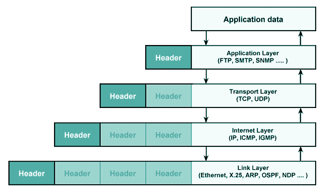

# OSI 7계층 모델
## 데이터의 기술적 개념
> 0 또는 1로 이루어진 숫자로 생각할 수 있음
- 컴퓨터는 이진법의 숫자를 켜짐과 꺼짐으로 표현할 수 있고, 따라서 데이터는 아주 긴 전기 신호로 생각할 수 있다.
- 아주 긴 케이블(?) 필요

## 프로토콜 (Protocol)
> 데이터가 상대 클라이언트 또는 서버로 전달되기 위한 표준화된 어떠한 약속 또는 절차
- 보내는 쪽에서는 데이터를 안전, 정확, 신속하게 규격화하는 포장 방법이 필요하고, 받는 쪽에서는 해석하는 방법을 필요로 하는데 그 기술적 약속을 가리킨다.
- 이에 걸맞게 아래와 같이 계층구조 모델이 등장하였다.

## 계층구조
- 네트워크 상에서 여러 대의 컴퓨터가 데이터를 주고 받으려면 이들을 서로 연동할 수 있도록 표준화된 인터페이스를 지원해야 한다. 
- OSI 7계층 모델과 TCP/IP 모델 모두 계층 구조를 갖고 있기 때문에, 자세히 알아보기 전에 먼저 계층 구조가 어떤 것인지 적용하면 어떤 점이 좋은지를 알 필요가 있다. 
- 계층 구조(Layered)는 네트워크 뿐만 아니라 운영체제 등 다양한 분야에서 적용되는데 계층 구조를 사용하는 목적은 분할 정복, 즉 문제를 해결하고자 할 때, 나누어 생각하면 쉽게 해결할 수 있다는 취지이다.
- 계층 구조의 또 다른 특징은 위, 아래 층으로만 이동할 수 있다는 점이다. 건너뛰어 한번에 맨위 또는 아래로 갈 수 없다. 
- 즉, 다음 단계로 넘어가려면 이전 계층이 전제조건이 되어야 한다.

## OSI 7계층 모델
> 네트워크 통신 과정을 7개의 계층으로 구분한 산업 표준 참조 모델

> ___PDU란?___
> - PDU(Process Data Unit)란 각 계층에서 전송되는 단위
> - PDU는 2계층 / 프레임(Frame), 3계층 / 패킷(Packet), 4계층 / 세그먼트(Segment)만 생각하면 된다. 
> - 네트워크 통신 과정을 깊게 이해하기 위해서는 왜 각각의 계층의 PDU가 다른지 알아야 하고, 역할에 대해 알고 있어야 한다.

### 1계층 : 물리계층 (Physical Layer)
- OSI 모델의 최하위 계층에 속하며, 상위 계층에서 전송된 데이터를 물리 매체(허브, 라우터, 케이들 등)를 통해 다른 시스템에 전기적 신호를 전송하는 역할을 한다.
- 즉, 기계어를 전기적 신호로 바꿔서 와이어에 실어주는 것이다.
- PDU : 비트(bit)  /  프로토콜 : Modem, Cable, Fiber, RS-232C  /  장비 : 허브, 리피터

### 2계층 : 링크계층 (Link Layer)
- 네트워크 기기들 사이의 데이터 전송을 하는 역할을 한다.
- 패킷을 프레임으로 구성하여 물리계층으로 전송하는데, 3계층에서 패킷을 받아 주소와 제어정보를 헤더와 테일에 추가한다.
- PDU : 프레임(Frame)  /  프로토콜 : 이더넷, MAC, PPP, ATM, LAN, Wifi  /  장비 : 브릿지, 스위치

### 3계층 : 네트워크계층 (Network Layer)
- 기기에서 데이터그램이 가는 경로를 설정해주는 역할을 한다.
- __라우팅 알고리즘__ 을 사용하여 최적의 경로를 선택하고 송신측으로부터 수신측으로 전송한다.
- 2계층이 노드 대 노드 전달을 감독한다면, 3계층은 각 패킷이 목적지까지 성공적이고 효율적으로 전달되도록 한다.
- PDU : 패킷(Packet)  /  프로토콜 : IP, ICMP 등  /  장비 : 라우터, L3 스위치

### 4계층 : 전송계층 (Transport Layer)
- 발신지에서 목적지 간 (End-to-End) 제어와 에러를 관리한다.
- 패킷의 전송이 유효한지 확인하고 전송에 실패된 패킷을 다시 보내는 것과 같은 신뢰성 있는(reliable) 통신을 보장하며, 헤드에는 세그먼트가 포함된다.
- 주소 설정, 오류 및 흐름 제어, 다중화를 수행한다.
- PDU : 세그먼트(Segment)  /  프로토콜 : TCP, UDP, ARP, RTP  /  장비 : 게이트웨이, L4 스위치

### 5계층 : 세션계층 (Session Layer)
- 통신 세션을 구성하는 계층으로, 포트 번호를 기반으로 연결한다.
- 동시 송수신(Duplex), 반이중(Half-Duplex), 전이중(Full-Duplex) 방식의 통신과 함께 체크 포인팅과 유후, 종료, 다시 시작 과정 등을 수행한다.
- 프로토콜 : NetBIOS, SSH, TLS

### 6계층 : 표현계층 (Presentation Layer)
- 송신측과 수신측 사이에서 데이터의 형식을 정해준다. (png, jpg 등)
- 받은 데이터를 코드 변환, 구문 검색, 암호화, 압축의 과정을 통해 올바른 표준방식으로 변환해준다.
- 프로토콜 : JPG, MPEG, SMB, AFP

### 7계층 : 응용계층 (Application Layer)
- 사용자와 바로 연결되어 있으며 응용 SW를 도와주는 계층이다.
- 사용자로부터 정보를 입력받아 하위 계층으로 전달하고 하위 계층에서 전송된 데이터를 사용자에게 전달한다.
- 파일 전송, DB, 메일 전송 등 여러 가지 응용 서비스를 네트워크에 연결해주는 역할을 한다.
- 프로토콜 : DHCP, DNS, FTP, HTTP

## TCP/IP 모델
> OSI 참조 모델은 말 그대로 참조 모델일 뿐 실제 사용되는 인터넷 프로토콜은 현재 대부분 TCP/IP 모델을 따른다.

- 인터넷 프로토콜 중 가장 중요한 역할을 하는 TCP와 IP의 합성어로 데이터의 흐름 관리, 정확성 확인, 패킷의 목적지 도달 보장을 담당한다.
- 데이터의 정확성 확인은 TCP가, 패킷을 목적지까지 도달하게 하는 일은 IP가 담당한다.

### 데이터 캡슐화
- 데이터를 아래 그림과 같이 단계별로 헤더를 붙여 전송하게 된다.

