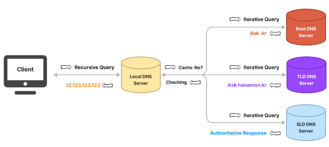
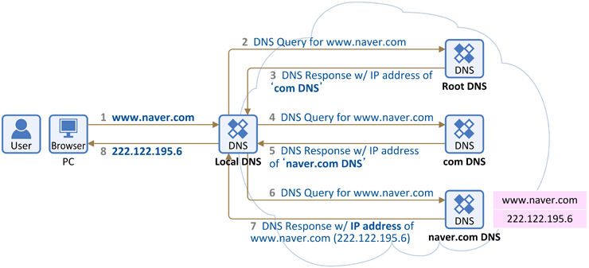

# DNS (Domain Name System)
## 개요
- HTTP의 메시지를 만들고나면, 이것을 OS에 의뢰해 액세스 대상의 웹 서버에 송신하게 된다. (브라우저는 URL 해독이나 HTTP 메시지 생성의 기능은 있으나 메시지를 네트워크에 송출하는 기능이 없음)
- URL 안에 쓰여있는 서버의 도메인명에서 IP 주소를 조사해야 하는데, OS에 송신을 의뢰할 때 IP 주소로 대상을 지정해야 하기 때문이다.
- 상위 기관에서 인증된 기관에게 도메인을 생성하거나 IP 주소로 변경할 수 있는 권한을 부여한다.
- DNS는 이처럼 상위 기관과 하위 기관과 같은 ‘계층 구조’를 가지는 분산 데이터베이스 구조를 가진다.

## 구성 요소
### 도메인 네임 스페이스 (Domain Name Space)
- DNS가 저장, 관리하는 계층적 구조를 의미한다.
- 최상위 루트 = DNS 서버
- 하위 노드 = 인터넷에 연결된 모든 노드
- 각 레벨은 그 하위 도메인에 관한 정보를 관리하는 구조를 가진다.

### 네임 서버 (Name Server, 권한 있는 DNS 서버)
- 문자열로 표현된 도메인 이름을 IP 주소로 변환하기 위한 도메인 네임 스페이스 트리 구조에 관한 정보를 담고 있는 서버
- 도메인 이름을 IP 주소로 변환하는 것을 네임 서비스라 한다.
- 리졸버(Resolver)로부터 요청받은 도메인 이름에 대한 IP 정보를 다시 리졸버로 전달해주는 역할을 수행한다.

### 리졸버 (Resolver, 권한 없는 DNS 서버)
- DNS 클라이언트의 요청을 네임 서버로 전달하고 네임 서버로부터 도메인 이름과 IP 주소를 받아 클라이언트에게 제공
- 수많은 네임 서버에 접근하여 사용자로부터 요청받은 도메인의 IP 정보를 조회하는 기능 수행

## 동작 방식

### DNS Query(쿼리)란?
- DNS 클라이언트와 DNS 서버는 DNS 쿼리를 교환한다.
- DNS 쿼리는 Recursive(재귀적) 또는 Iterative(반복적)으로 구분된다.
### Recursive Query (재귀적 질의)
- 결과물(IP 주소)를 돌려주는 작업이다. (결과적으로 Recursive 서버가 Recursive 쿼리를 웹 브라우저 등에게 돌려주는 역할을 한다.)
- Recursive 쿼리를 받은 Recursive 서버는 Iterative 하게 권한 있는 네임 서버로 Iterative 쿼리를 보내서 결과적으로 IP 주소를 찾게 되고 해당 결과물을 응답한다.
- 사전적 의미로써 재귀로, 응답을 돌려주는 쿼리라고 생각하자.
### Iterative Query (반복적 질의)
- Recursive DNS 서버가 다른 DNS 서버에게 쿼리를 보내어 응답을 요청하는 작업이다.
- Recursive 서버가 권한 있는 네임 서버들에게 반복적으로 쿼리를 보내서 결과물(IP 주소)를 알아낸다.
- Recursive 서버에 이미 IP 주소가 캐시 되어있다면 이 과정은 건너 뛴다.

## DNS 동작 순서

### 1번 과정 
- 웹 브라우저에 www.naver.com 을 입력하면 먼저 PC에 저장된 Local DNS(기지국 DNS 서버)에게 "www.naver.com" 이라는 hostname"에 대한 IP 주소를 요청한다.
- Local DNS 에는 "www.naver.com 의 IP 주소"가 있을 수도 없을 수도 있다. (본 설명에서는 Local DNS에 "www.naver.com 의 IP 주소"가 없다고 가정 한다.)
- 만일 예전에 네이버에 접속했던 적이 있다면, Local DNS에 접속정보가 캐싱이 되어있어 바로 PC에 IP 주소를 주고 끝난다. (바로 1번 → 8번으로 넘어가 빠르게 웹페이지에 접속할수 있다)

> Local DNS(기지국 DNS 서버)란?
> - 기본적으로 인터넷을 사용하기 위해선 IP를 할당해주는 통신사(KT, SK, LG 등...)에 등록하게 된다.
> - 컴퓨터의 LAN선을 통해 인터넷이 연결되면, 가입했던 각 통신사의 기지국 DNS 서버가 등록되게 된다.
> - 그러니까 KT를 사용하는 집이면 KT DNS가 되고, SK통신사 사용하는 집이면 SK DNS가 자동으로 셋팅 된다.

### 2번 과정
- 그러면 Local DNS는 이제 "www.naver.com 의 IP 주소"를 찾아내기 위해 다른 DNS 서버들과 통신(DNS 쿼리)을 시작한다.
- 먼저 Root DNS 서버에게 "www.naver.com 의 IP 주소"를 요청한다.

> Root DNS(루트 네임서버)란?
> - Root DNS는 인터넷의 도메인 네임 시스템의 루트 존이다.
> - ICANN이 직접 관리하는 절대 존엄 서버로, TLD DNS 서버 IP들을 저장해두고 안내하는 역할을 한다.
> - 전세계에 961개의 루트 DNS가 운영되고 있다.

### 3번 과정
- Root DNS 서버는 "www.naver.com 의 IP 주소" 를 찾을 수 없어 Local DNS 서버에게 "www.naver.com 의 IP 주소 찾을 수 없다고 다른 DNS 서버에게 물어봐" 라고 응답을 한다.

### 4번 과정
- 이제 Local DNS 서버는 com 도메인을 관리하는 TLD DNS 서버(최상위 도메인 서버)에 다시 www.naver.com에 대한 IP 주소를 요청한다.

> TLD(Top-Level Domain, 최상위 도메인) DNS Server 란?
> - TLD는 도메인 등록 기관(Registry)이 관리하는 서버로, 도메인 네미의 가장 마지막 부분을 말한다.
> - 예를 들어 웹사이트에서 한번쯤은 봐왔던 .com 이나 co.kr 같은 도메인들을 관리하고 부여하는 서버이다.
> - Authoritative DNS 서버 주소를 저장해두고 안내하는 역할을 한다.

### 5번 과정
- com 도메인을 관리하는 DNS 서버에도 해당 정보가 없으면, Local DNS 서버에게 "www.naver.com 의 IP 주소 찾을 수 없음. 다른 DNS 서버에게 물어봐" 라고 응답을 한다.

### 6번 과정 
- 이제 Local DNS 서버는 naver.com DNS 서버(Authoritative DNS 서버)에게 다시 "www.naver.com 의 IP 주소" 를 요청한다.
> Authoritative DNS Server 란?
> - 실제 개인 도메인과 IP 주소의 관계가 기록/저장/변경되는 서버.
> - 따라서, 권한의 의미인 Authoritative가 붙는다.
> - 일반적으로 도메인/호스팅 업체의 네임서버를 말하지만, 개인이나 회사 DNS 서버 구축을 한 경우에도 여기에 해당하게 된다.

### 7번 과정
- naver.com DNS 서버 에는 "www.naver.com 의 IP 주소" 가 있다.
- 그래서 Local DNS 서버에게 "www.naver.com 에 대한 IP 주소는 222.122.195.6" 라는 응답을 한다.

### 8번 과정
- 이를 수신한 Local DNS는 www.naver.com 의 IP 주소를 캐싱을 하고 이후 다른 요청이 있을시 응답할 수 있도록 IP 주소 정보를 단말(PC)에 전달해 준다.

### Tip
- 이렇게 Local DNS 서버가 여러 DNS 서버에 차례대로 (Root DNS 서버 → TLD DNS 서버(.com) → Authoritative DNS 서버(naver.com) 요청하여 그 답을 찾는 과정을 재귀적 쿼리 Recursive Query 라고 부른다.

