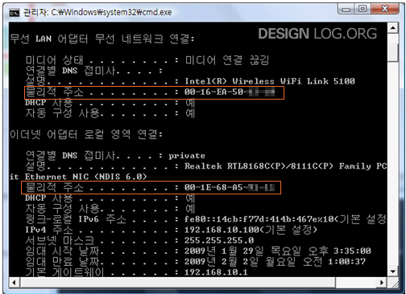

# MAC Address
## 개요
- MAC는 미디어 액세스 컨트롤(Media Access Control)의 준말이다.
- 컴퓨터 간 통신을 위해서 서로를 구분할 일종의 주소가 필요하게 되는데 이 역할을 바로 MAC Address가 담당하게 된다.
- 그러면 IP 주소가 뭐지? IP 주소도 통신을 위해서 각 장비마다 IP 주소를 배정하게 되고 그 주소를 가지고 통신하는 것 아니야? IP 주소를 사용하는 것은 맞지만 이 경우에도 MAC address를 사용한다.
- 즉, 우리가 통신을 할때 IP 주소를 다시 MAC 주소로 바꾸는 절차(ARP)를 밟고 있다.

## MAC address 알아내기

- cmd 에서 ipconfig/all 이라는 명령어를 사용했을 때 위와 같이 출력된다.

## 설명
- 네트워크에 붙는 각 장비들은 48bit(6 octet, octet이란 8개의 bit를 묶은 것을 말합니다.)의 주소를 갖게 된다.
- 이 주소는 컴퓨터의 하드웨어의 랜카드 또는 네트워크 장비에 이미 고정되어 있는 주소이고 유일한 주소이다.(전 세계에 유일한 주소)
- 해당 주소를 MAC Address라고 부르거나 하드웨어 주소라고 한다.

## 표기법
> - 하이픈 : 00-60-97-8F-4F-86
> - 콜론 : 00:60:97:8F:4F:86
> - 점 : 0060.978F.4F86

- 48bit의 MAC Address를 16진수로 표현한 것이다.
- 앞쪽 6개의 16진수는(00-60-97) 생산자를 나타내는 코드이다. 해당 코드를 OUI(Organizational Unique Identifier)라고 한다. (제조사의 식별 코드)
- 뒤에 오는 나머지 6자리가 Host Identifier라고 한다. 쉽게 생각해 제조사에서 붙인 제품의 시리얼 넘버이다.
- 정리하자면 MAC address 중에서 앞쪽 절반은 약속된 규정에 따라 각 네트워크 장비를 만드는 회사에 분배해주고, 해당 회사에서는 나머지 절반을 일련번호로 만들어 각 장비에 부여한다.

## MAC address를 통한 간략한 통신과정

### 같은 네트워크 상에 있을 경우

1. Y라는 PC와 Z라는 PC가 있다고 가정하자.
2. PC Y는 자신이 속한 네트워크의 모든 PC에게 "Z라는 이름을 가진 PC는 맥주소를 전달해 주세요!"라는 메시지를 보낸다. (Broadcast)
3. 위의 경우 Z는 Y와 같은 네트워크에 속해 있기 때문에 Broadcast를 받게 된다.
4. Z는 Y에게 MAC address를 알려주고, Y는 받은 MAC address로 통신을 시작하게 된다.

### 다른 네트워크 상에 있을 경우

1. Y가 Broadcast를 보낸다.
2. 하지만 이 경우, 자신이 속한 네트워크상에서는 Z라는 PC가 없기 때문에 ARP Request를 받지 못한다.
3. 하지만 해당 네트워크에는 Z가 없으므로 라우터가 대신 다른 네트워크에 있는 Z를 찾아 전달해주게 된다.
4. 따라서 Y는 Z에게 정보를 보낼 때 받는 MAC address를 라우터의 MAC address로 보내게 됩니다!
5. Z가 속한 네트워크의 라우터로 전달한다.
6. 라우터가 Z의 MAC address를 알아낸 후 Z의 MAC address를 이용해서 전달하게 된다.
