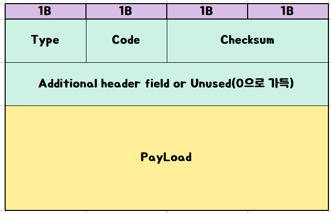
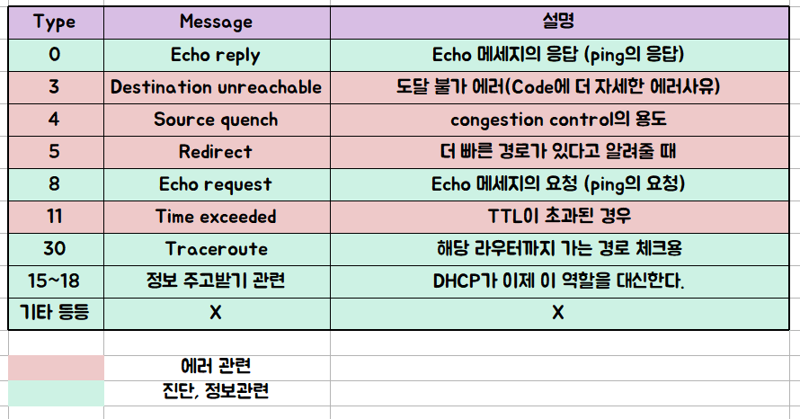

# ICMP (Internet Control Message Protocol)

## 개요
- TCP/IP 환경에서 IP 패킷을 처리할때 발생하는 오류를 알려주는 프로토콜이다.
- IP는 오직 패킷이 목적지에 도달했는지만 확인하기 때문에, 어떤 이유로 에러가 발생했는지는 알려주지 못한다. 
- 그래서 이러한 단점을 보완하기위해 나온게 바로 ICMP이다.

## 패킷의 형태
<p align="center"></p>

- __Type__ : ICMP의 패킷 종류를 의미한다
- __Code__ : Type에서 파생된 세부 분류를 의미한다
- __Checksum__ : 코드의 오류가 없는지 검증해준다.
- __Additional header field__ : Type에 따라 사용되는 부분으로 사용되지 않는다면 0으로 채워진다
- __Payload__ : 직접적인 데이터 내용이 있는 부분이다

## Type의 세부 내용
<p align="center"></p>

- 먼저 에러타입 3번에 해당하는 Destination Unreachable 코드들은

```
code 0: Network 도달불가
code 1: Host 도달불가
code 2: protocol 도달불가
code 3: port 도달불가
code 4: fregment(단편화)가 필요하지만 DF(dont fregment)가 설정되어 있음
```

이렇게 5가지가 있다.

- 에러타입 4번에 해당하는 Source quench 오류코드는 TCP가 congestion control을 지원하게 되면서 사용하지 않는다. (UDP는 애초에 해당사항 없음)
- 그 다음 에러타입 5번에 해당하는 Redirect는 default router가 지금 상황이 최적의 경로가 아니라고 판단했을 때 보내지는 코드로 더 나은 게이트웨이를 알려준다.
- 마지막으로 에러타입 11번에 해당하는 Time Exceeded는 2가지 경우에 발생하는데
```
1.TTL(Time To Live)가 0일때
2.Fregment가 손상되어 재조합이 불가능할때
```

가 있다.
