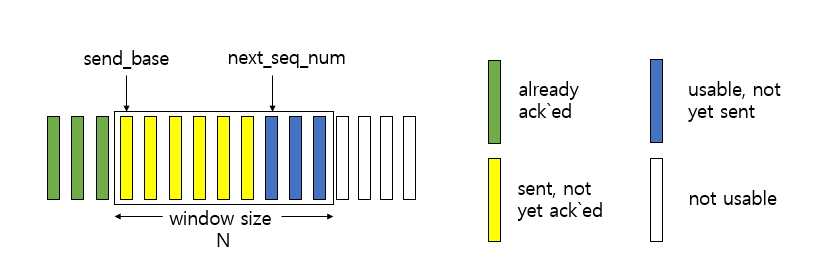
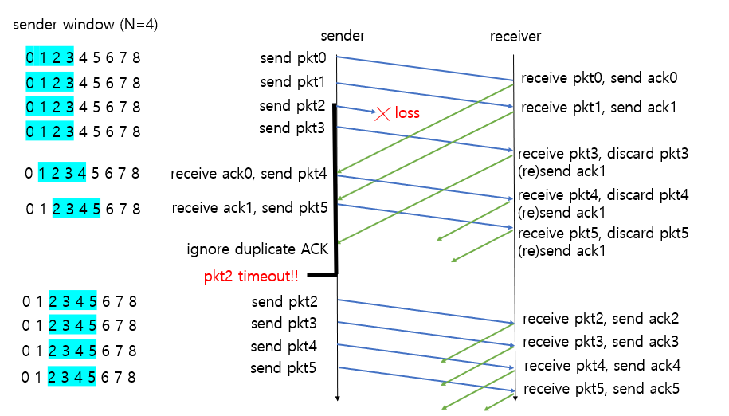
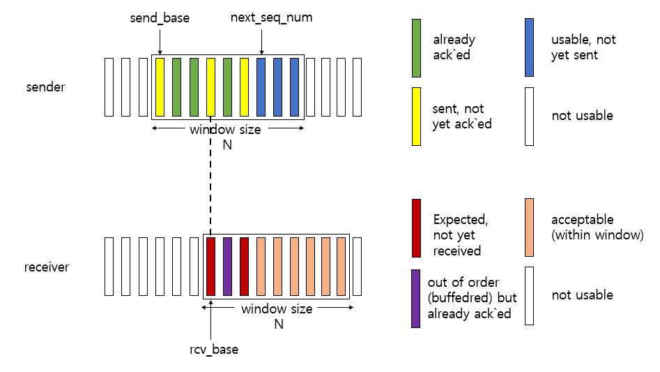
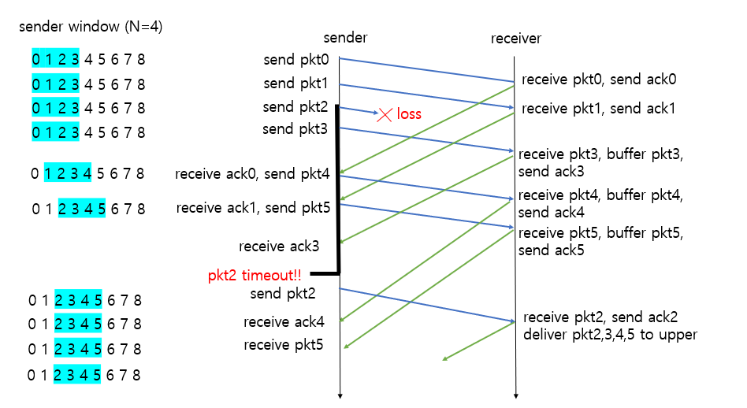
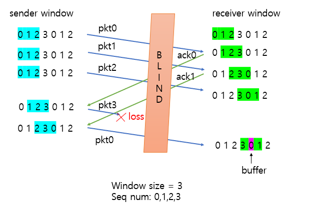
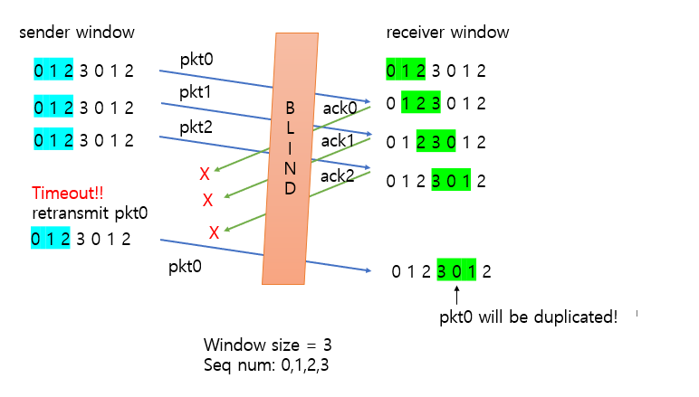
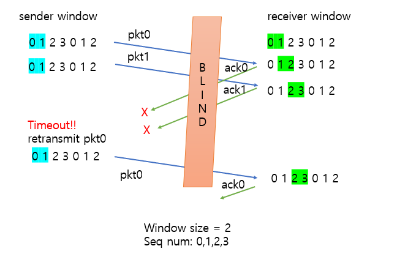

# Pipelined Protocols

- pipelined protocols에서 pipelining은 송신자가 다수의 패킷을 한 번에 보내는 것을 말한다. 
- 즉 ACK 신호를 받을 때까지 기다리다 ACK 신호를 받고나서 다음 데이터를 보내는 stop and wait 방식과 다르게 송신자가 ACKs 신호를 받지 않아도 패킷 여러 개를 보내는 방식이다. 
- 송신자와 수신자가 버퍼를 가져야 하며, 대표적인 두 가지 프로토콜로 __Go-Back-N__ 과 __Selective Repeat__ 이 있다.

## Go-Back-N (GBN)

### 특징
- Go-Back-N 방식은 송신 측에서 전송할 패킷의 개수를 정한다.
- 버퍼에 그 개수만큼의 패킷을 저장하여 전송한다.
- 버퍼를 window, 버퍼의 사이즈를 window size라고 한다. 
- 버퍼의 시작점인 send_base, 다음에 보낼 패킷 번호인 next_seq_num을 가진다.
- 수신 측은 이번에 받을 패킷의 번호를 기억하고 있는다.
- 이 때, 수신측은 누적 ACK(Cumulative ACK)을 사용한다. 
- 각 버퍼가 전송될 때 ACK를 받지 못한 가장 오래된 패킷의 Timer를 기준으로 Timeout이 발생한다.
- Timeout 이 발생하면 window에 있는 모든 패킷을 전송한다.

### 동작 예시

1. window size가 4인 상황에서 GBN의 동작이다. 가장 먼저 패킷 0,1,2,3을 전송한다. 전송 도중에 패킷 2가 손실되었다.
2. 수신 측은 패킷 0과 1을 잘 받았으므로 ACK 0,1을 보내고 패킷 2가 오기를 기다린다.
3. 송신 측은 ACK 0을 받았으므로 send_base를 한 칸 옆으로 밀고 (send_base가 0에서 1이 됨) 패킷 4를 보낸다.
4. 송신 측은 ACK 1을 받았으므로 send_base를 한 칸 옆으로 밀고 (send_base가 1에서 2가 됨) 패킷 5를 보낸다.
5. 수신 측은 패킷 2를 기다렸으나 패킷 2가 오지 않고 패킷 3이 왔으므로 패킷 3을 버리고 가장 최근에 수신 성공한 패킷 1에 대한 ACK1(Culmulative ACK)을 보낸다.
6. 수신 측은 패킷 2를 기다렸으나 패킷 2가 오지 않고 패킷 4가 왔으므로 패킷 4를 버리고 가장 최근에 수신 성공한 패킷 1에 대한 ACK1(Culmulative ACK)을 보낸다.
7. 수신 측은 패킷 2를 기다렸으나 패킷 2가 오지 않고 패킷 5가 왔으므로 패킷 5를 버리고 가장 최근에 수신 성공한 패킷 1에 대한 ACK1(Culmulative ACK)을 보낸다.
8. 송신 측은 중복된 ACK은 모두 무시한다.
9. 송신 측은 패킷 2를 보내고 일정 시간이 지나도 ACK가 오지 않아 Timeout이 발생한다.
10. Timeout 이 발생했으므로 윈도우의 모든 패킷을 전송한다. 즉, 패킷 2, 3, 4, 5를 보낸다.

## Selective Repeat (SR)

### 특징
- GBN의 비효율성을 해결하기 위한 방식이다.
- 송신 측은 각 패킷마다 timer를 설정하고 timeout 된 패킷만 재전송한다. (GBN처럼 버퍼 모두를 전송하지 않음)
- 수신 측도 버퍼(window)를 가지고 있다. 
- 수신 측은 기다리던 패킷이 오면 바로 상위 계층으로 전달하고 ACK 신호를 보낸다.
- 수신 측은 기다리고 있던 패킷이 오지 않으면 일단 buffer에 넣어놓고 ACK 신호를 보낸다.
- 수신 측의 버퍼가 가득 차면(패킷이 모두 도착하면) 상위 계층으로 전달한다.
- GBN보다 효율적으로 보이지만 모든 패킷에 timer가 있기 때문에 overhead가 크다.

### 동작 예시

1. window size가 4인 상황에서 SR의 동작이다. 가장 먼저 패킷 0, 1, 2, 3을 보낸다. 전송 도중 패킷 2가 손실되었다.
2. 수신 측은 패킷 0과 1을 잘 받았으므로 ACK 0, 1을 보내고 패킷 0과 1을 상위 계층에 전달한 다음 패킷 2가 오기를 기다린다.
3. 송신 측은 ACK 0을 받았으므로 send_base를 한 칸 옆으로 밀고 (send_base가 0에서 1이 됨) 패킷 4를 보낸다.
4. 송신 측은 ACK 1을 받았으므로 send_base를 한 칸 옆으로 밀고 (send_base가 1에서 2가 됨) 패킷 5를 보낸다.
5. 수신 측은 패킷 2를 기다렸으나 패킷 2가 오지 않고 패킷 3이 왔으므로 패킷 3을 버퍼에 넣어놓고 ACK 3을 보낸다.
6. 수신 측은 패킷 2를 기다렸으나 패킷 2가 오지 않고 패킷 4가 왔으므로 패킷 4를 버퍼에 넣어놓고 ACK 4를 보낸다.
7. 수신 측은 패킷 2를 기다렸으나 패킷 2가 오지 않고 패킷 5가 왔으므로 패킷 5를 버퍼에 넣어놓고 ACK 5를 보낸다.
8. 송신 측은 ACK 3, 4, 5는 기록만 하고 send_base(pkt2)에 대한 ACK이 오지 않았으므로 send_base를 밀지는 않는다.
9. 패킷 2에 대한 timer가 timeout이 됐으므로 패킷 2를 다시 보낸다. 
10. 수신 측은  패킷2를 받고, 버퍼에 있는 패킷까지 포함해 패킷 2, 3, 4, 5를 상위계층에 보낸 다음 ACK 2를 보낸다.
11. 이후 ACK2가 송신 측에 도착하면 send_base가 2에서 3이 될 것이다.

### Selective Repeat Dilemma (SR 딜레마)
- SR은 GBN에 비해 매우 효율적으로 보인다. 하지만 SR은 큰 딜레마를 가지고 있다.

