# RDT (Reliable Data Transfer)

## 정의
- RDT는 신뢰성 있는 데이터 교환을 의미한다. 즉, 송/수신하는 데이터가 오류없이 온전히 전송되는 것을 뜻한다.
- Transport Layer(전송계층)에서는 신뢰성 있는 데이터 교환을 하고 싶어 하지만, 하위 레이어들에서는 신뢰성을 보장할 수 없기 때문에 문제가 발생할 수 있다. 
- 이를 해결하기 위해 Transport Layer에서 RDT 프로토콜을 이용할 수 있다.

## 데이터 송/수신 예시 (RDT 프로토콜 사용)

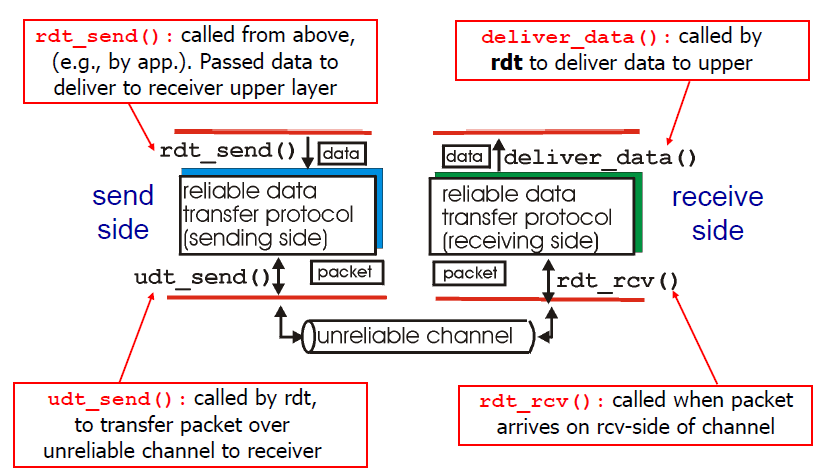

### 송신 측
- 상위 layer에서 보내려는 데이터가 있다면 rdt_send()를 호출해 데이터를 RDT 프로토콜로 전송한다.
- RDT 프로토콜에서 신뢰할 수 없는 채널인 하위 layer로 보낼 때 udt_send()를 호출해 패킷을 전송한다.
### 수신 측
- 하위 layer에서 받은 패킷이 있다면 rdt_rcv()를 호출해 RDT 프로토콜로 전송한다.
- RDT 프로토콜에서 상위 layer로 데이터를 보낼 때 deliver_data()를 호출해 데이터를 전송한다.

## FSM (Finite State Machines)

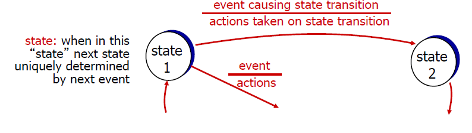

- FSM이란 유한개의 상태(state)가 존재할 때, 어떠한 상태(state)가 어떠한 사건(event)에 의해 다른 상태(state)로 변하는 전이(transition)가 발생하는 것을 도식화한 모델이다. 
- 즉, event는 상태를 변화시키는 원인이고, actions는 상태가 변화할 때 취하는 행동을 말한다.

## rdt 1.0 (reliable transfer over a reliable channel)

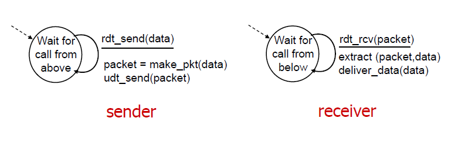

- rdt 1.0은 완전히 안정적이라고 생각한다. 즉, bit error나 packet loss 등이 전혀 없다고 생각한다. (상태가 하나뿐)

### 송신 측
1. 상위 layer에서 데이터를 보내오면 rdt_send(data) 호출
2. make_pkt(data)로 packet을 만듦
3. udt_sent(packet) 호출해 패킷을 전송함
### 수신 측
1. 하위 layer에서 데이터를 받아오면 rdt_rcv(packet) 호출
2. extract(packet, data)를 호출해 패킷에서 데이터 추출
3. deliver_data(data) 호출해 상위 layer로 데이터를 보냄

## rdt 2.0 (channel with bit errors)

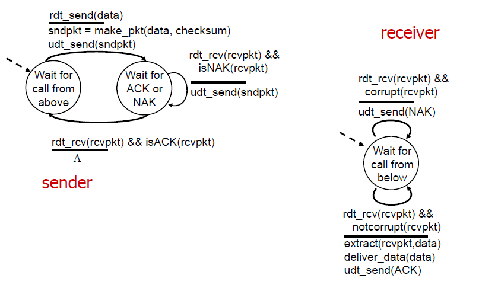

- rdt 1.0 과 다른 점은 rdt 2.0 에서는 bit error가 발생할 수 있다고 생각한다는 점이다. 따라서 이 때 에러 처리를 위해 ACKs와 NAKs를 사용한다.

    `ACKs(Acknowledgements) : 수신 측이 송신 측에게 패킷을 제대로 받았다고 말하는 것` 
    `NAKs(Negative Acknowledgements) : 수신 측이 송신 측에서 패킷에 오류가 있다고 말하는 것`

- rdt 2.0 에서는 에러가 없는 경우와 에러가 있는 경우 두 가지를 나누어 설명한다.

## rdt 2.0 (open with no errors, 에러가 없는 경우)

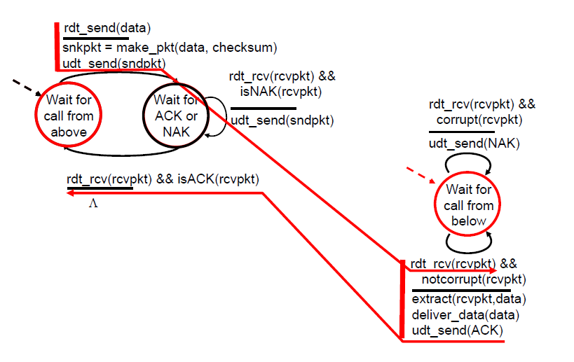

1. (송신 측) 상위 layer에서 데이터를 받아온다.
2. 데이터를 패킷으로 만들어 udt_send()로 보낸다.
3. 수신 측에서 패킷을 받는다. 
4. 이상이 없으므로 ACK 신호를 송신 측으로 보낸다.
5. 송신 측에서 ACK 신호를 받고 종료한다. 

## rdt 2.0 (operaion with errors, 에러가 있는 경우)

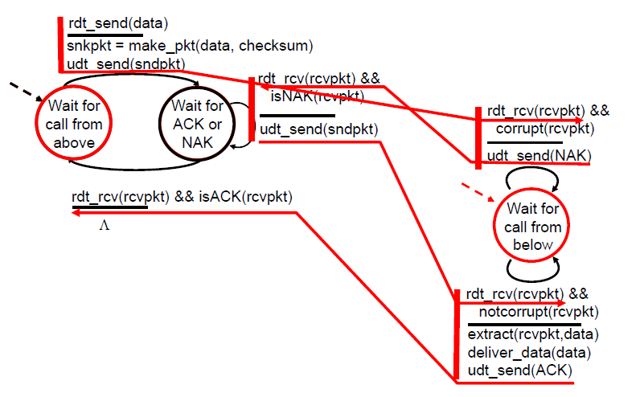

1. (송신 측) 상위 layer에서 데이터를 받아온다.
2. 데이터를 패킷으로 만들어 udt_send()로 보낸다.
3. 수신 측에서 패킷을 받는다.
4. 패킷에 이상이 있으므로 NAK 신호를 송신 측에 보내고 기다린다.
5. 송신 측에서 NAK 신호를 받으면, 데이터를 다시 수신 측으로 재전송한다.
6. 수신 측에서 패킷을 받는다.
7. 이상이 없다면 ACK 신호를 송신 측에 보낸다.
8. 송신 측에서 ACK 신호를 받고 종료한다.

## rdt 2.0 의 치명적 결함
- ACK/NAK 신호에 오류가 발생하거나 손실될 수 있다.
- 예를 들어 수신 측에서 패킷에 오류를 탐지하고 ACK 신호를 송신 측에 보냈으나 이것이 손실될 수 있다.
- 이런 경우 수신 측은 무한정으로 ACK 혹은 NAK 신호를 기다리게 될 수 있다.
- 또한 ACK/NAK 신호에 중복이 발생해 패킷이 중복으로 재전송될 수 있다.
- 위와 같은 문제를 해결하기 위해 rdt 2.1 이 등장하였다.

## rdt 2.1
> rdt 2.1 은 패킷에 seq #(순서 번호)을 추가해 rdt 2.0의 문제점을 해결한다.

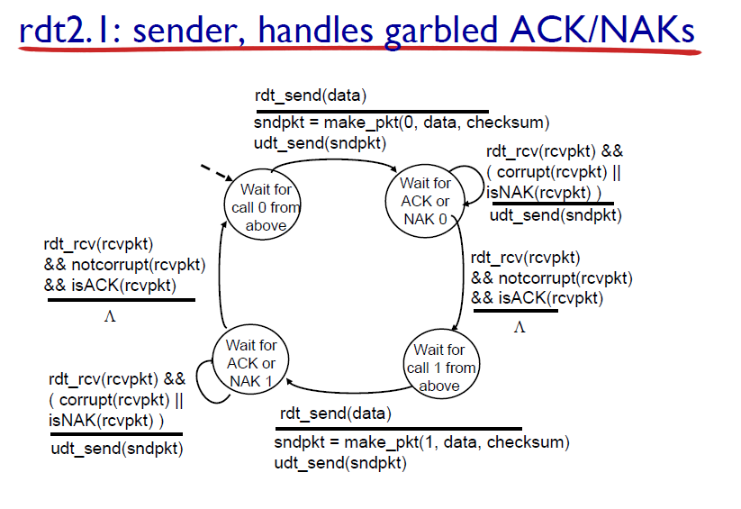

> 위 그림은 rdt 2.1 송신 측의 FSM이다.
1. 송신 측에서 0번 패킷을 보내고 ACK 0 혹은 NAK 0 신호를 기다린다.
2. 0번 패킷이 수신 측에서 에러가 발생했다면 NAK 0를 받을 것이고 수신 측으로 0번 패킷을 재전송할 것이다.
3. 0번 패킷이 정상적으로 전송되었다면 ACK 0를 받을 것이고 다음 패킷인 1번 패킷을 전송한다.
4. 마찬가지로 ACK 1 혹은 NAK 1 신호를 기다리고 위와 같은 과정을 모든 패킷을 보낼 때까지 반복한다.

- 따라서 순서 번호는 0과 1이면 충분하다. 순서 번호는 패킷의 중복 재전송을 막기 위해 부여하는 것이므로 중복인지 아닌지 판단하는 데에는 0과 1 이면 충분하기 때문이다.  

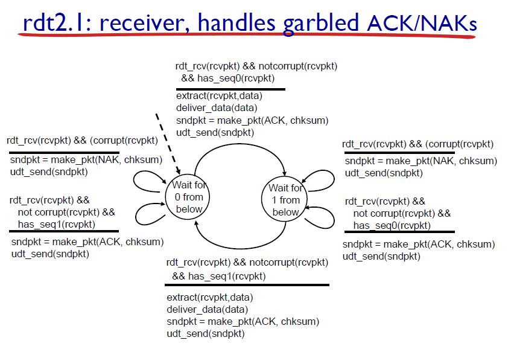

> 위 그림은 rdt 2.1 수신 측의 FSM이다.
1. 0번 패킷에 오류가 있다면 NAK 0 신호를 보내고 0번 패킷이 오길 기다린다.
2. 0번 패킷에 오류가 없다면 ACK 0 신호를 보내고 1번 패킷이 오길 기다린다.
3. 1번 패킷에 오류가 있다면 NAK 1 신호를 보내고 1번 패킷이 오길 기다린다.
4. 1번 패킷에 오류가 없다면 ACK 1 신호를 보내고 0번 패킷이 오길 기다린다. 

## rdt 2.2 (NAK-free protocol)
> rdt 2.2는 rdt 2.1과 같은 기능을 가진다. 다른 점은 rdt 2.2는 NAK 대신 ACK 만을 사용한다는 점이다.

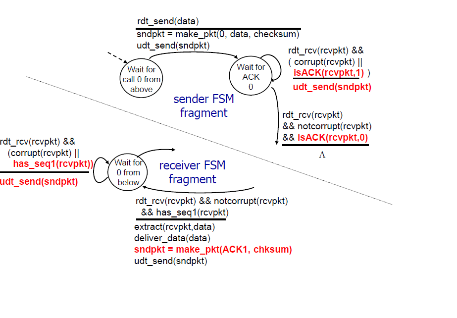

1. 중복되는 ACK 신호를 받으면 현재 패킷을 다시 재전송하면 된다. 
2. 예를 들어 0번 패킷을 보내고 제대로 송신되어서 ACK 0를 받았다고 하자. 
3. 이후 1번 패킷을 보냈는데 수신 측에서 오류를 탐지했다면, ACK 1이 아닌 가장 최근에 전송에 성공한 ACK 0를 보낸다.
4. 수신 측은 ACK 1을 기대했으나 ACK 0를 중복으로 받았으므로 오류가 발생했다는 사실을 알고 1번 패킷을 재전송한다.

- rdt 2.0/2.1/2.2는 패킷 에러에는 대응할 수 있으나 아직 큰 결함이 있다.
- 그것은 바로 ACK/NAK 혹은 패킷이 중간에 유실되는 경우에는 대응할 수 없다는 점이다. 
- 예를 들어 송신 측에서 ACK 신호를 기다리고 있으나 ACK 신호가 오지 않아 다음 패킷을 보내지 못할 수 있다.
- 이를 해결하기 위해 rdt 3.0 이 등장한다.

## rdt 3.0 (channels with errors and loss)
> 송신 측에서 ACK 신호를 합리적인(reasonable) 시간 동안 기다리고, 만약 ACK 신호가 이 시간 동안 도착하지 않으면 패킷을 재전송한다.  

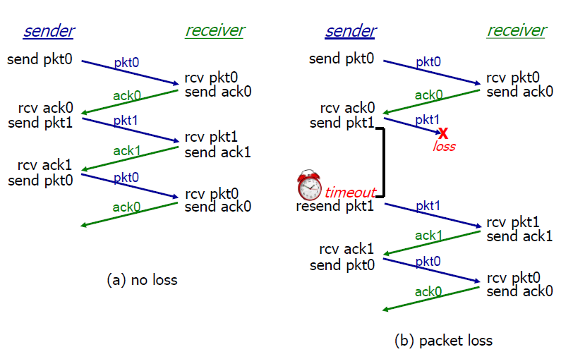

#### (a)는 패킷이 손실되지 않고 정상적으로 전달됐을 때의 과정이다.

#### (b)는 패킷이 중간에 손실됐을 경우이다.
- 만약 패킷 1이 유실된다면 ACK1 신호가 오지 않을 것이다.
- 송신 측은 한동안 ACK1 신호를 기다리다 일정 시간 이후 다시 패킷 1을 재전송할 것이다. 

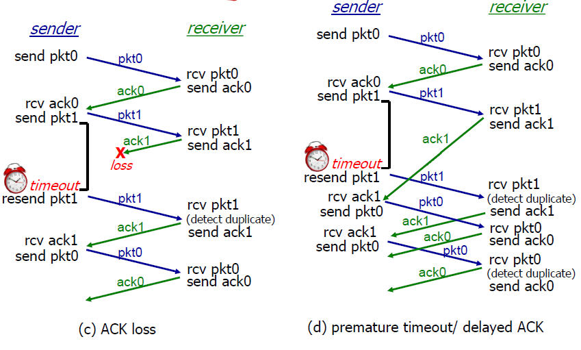

#### (c)는 ACK가 손실됐을 때의 과정이다.
- 송신 측은 패킷1을 보내고 ACK1 신호를 기다릴 것이다.
- 일정 시간 이후 다시 패킷 1을 재전송 할 것이다.
- (b)와 다른 점은 수신 측이 패킷1을 중복으로 받았다는 것이다.
- 이는 seq #로 해결 가능하다. 수신 측은 패킷 1을 받고나서 패킷 0을 기다릴 것이다. 그러나 이때 패킷1이 재전송되어 중복으로 왔으므로 그냥 패킷1을 버리면 된다. 
- 패킷 1을 버리고 나서 다시 ACK 1 신호를 보내면 문제가 해결된다.

#### (d)는 ACK 신호 전달이 지연됐을 때의 과정이다.
- 송신 측은 패킷 1을 보내고 ACK 1 신호를 기다릴 것이다.
- 이 때 ACK 1 신호가 매우 느리게 전송된다고 하자.
- 송신 측은 일정 시간이 지나도 ACK 1 신호가 오지 않아 패킷 1을 재전송했다.
- 패킷 1을 재전송하고 나서 ACK 1 신호를 받았다. 따라서 다음 패킷인 패킷 0을 보냈다. 
- 수신 측은 패킷 1을 중복해서 받고 ACK 1 신호를 다시 보낸다.
- 송신 측은 ACK 1을 받고 다시 패킷 0을 재전송한다. 
- 계속해서 중복으로 패킷과 ACK 신호가 재전송되는 문제가 발생한다. 

## rdt 3.0 의 문제점
- ACK 신호가 지연된다면 위와 같이 전송이 꼬이는 문제가 발생한다. 
- 또한 rdt 3.0은 데이터를 하나 보내고 ACK 신호를 기다릴 때까지 다음 데이터를 보내지 않아 성능이 매우 좋지 않다.
- 이러한 점들을 개선한 것이 Pipelined Protocols 이다.
