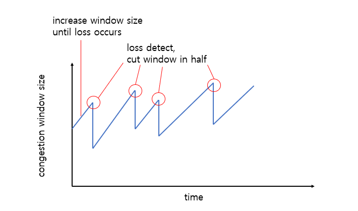
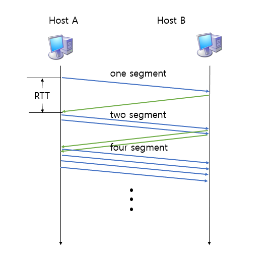
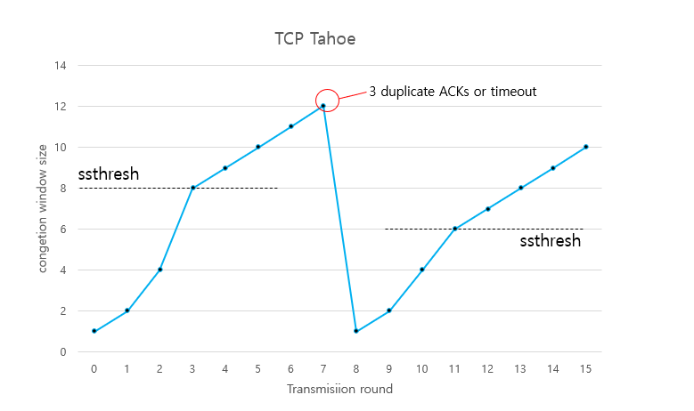
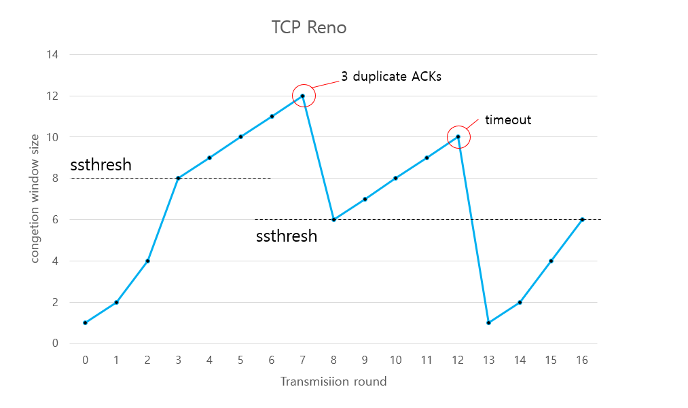

# TCP 혼잡 제어 (Congestion Control)
## 정의
- '혼잡하다'라는 말의 의미는 너무 많은 data를 전송해 네트워크가 이를 처리하지 못하는 상태를 말한다.
- 구체적으로 설명하자면 데이터의 양이 수신 측에서 처리할 수 있는 양을 초과하게 되면 송신 측에서는 수신 측에서 처리하지 못한 데이터를 손실 데이터로 간주하고 계속 재전송하게 되므로 네트워크가 더욱 혼잡해진다.
- 이러한 혼잡 상태를 제어하는 것을 혼잡 제어라고 한다.

## 방법
### AIMD (Additive Increase Multicative Decrease)
> 송신 측이 transmission rate(window size)를 패킷 손실이 일어날 때까지 증가시키는 접근법 

- __additive increase__ : 송신 측의 window size를 패킷 손실이 감지될 때까지 매 RTT마다 1 MSS(Maximum Segment Size)씩 증가시킨다.
- __multiplicative decrease__ : 손실이 감지되었다면 송신 측의 window size를 절반으로 감소시킨다.
- AIMD는 window size를 1 MSS씩 밖에 증가시키지 않기 때문에 네트워크의 모든 대역을 활용하여 빠른 속도로 통신하기까지 시간이 오래 걸린다는 단점이 있다.

### TCP Slow Start
> 송신 측이 window size를 1부터 패킷 손실이 일어날 때까지 지수승(exponentially)으로 증가시키는 방법

- 초기 window size : 1 MSS
- 매 RTT마다 window size를 2배로 키운다. (1, 2, 4, 8, 16 ...)
- 패킷 손실이 감지되면 window size를 1 MSS로 줄인다.
- 처음에는 window size가 1부터 시작하므로 느리나 지수승으로 window size가 커지므로 속도가 빠르게 증가한다.

`임계점(Threshold) : 여기까지만 slow start를 사용하겠다라는 의미를 가짐`

## 정책
### TCP Tahoe
> TCP Tahoe는 처음에는 Slow Start를 사용하다가 임계점(Threshold)에 도달하면 AIMD 방식을 사용한다.

- 처음 window size는 1 MSS이다.
- 임계점까지는 Slow Start를 사용한다(window size가 2배씩 증가한다)
- 임계점부터는 AIMD 방식을 사용한다(window size가 1씩 증가한다)
- 3 duplicate ACKs 혹은 timeout을 만나면 임계점을 window size의 절반으로 줄이고 window size를 1로 줄인다.
- TCP Tahoe 방식은 3 duplicate ACKs를 만나고 window size가 다시 1부터 키워나가야 하므로 속도가 느리다. __이를 해결할 수 있는 방식이 TCP Reno이다.__

### TCP Reno
> TCP Reno는 TCP Tahoe와 비슷하지만 3 dupicate ACKs와 timeout을 구분한다는 점이 다르다.

- 처음 window size는 1 MSS이다.
- 임계점까지는 Slow Start를 사용한다( window size가 2배씩 증가한다)
- 임계점부터는 AIMD 방식을 사용한다( window size가 1씩 증가한다)
- 3 duplicate ACKs를 만나면 window size를 절반으로 줄이고 임계점을 그 값으로 설정한다.
- timeout을 만나면 window size를 1로 줄인다. 임계점은 변하지 않는다.
