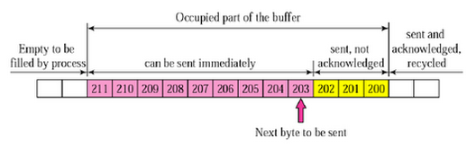
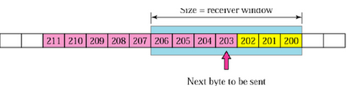

# TCP 흐름 제어
## 정의
> 송신측과 수신측의 데이터 처리 속도 차이를 해결하기 위한 기법

- 즉, 수신측이 너무 많은 패킷을 수신받지 않도록 하기 위함이다. 
- 수신측에는 패킷을 수신받는 버퍼의 크기가 정해져있는데, 만약 송신측의 전송 속도가 너무 빨라 한 번에 수많은 패킷을 수신받아 버린다면, 버퍼가 가득 차 손실되는 패킷들이 발생할 것이다.
- 수신측의 처리 속도가 더 빠른 것은 문제가 되지 않지만, 위와 같은 상황처럼 송신측의 처리 속도가 더 빠를 경우 분명히 이를 제어할 수단이 필요하다. 
- 따라서 TCP 에서는 흐름제어 기법을 사용한다.

## 패킷 전송 과정
1. Application Layer : 송신측 Application Layer가 소켓에 데이터를 입력
2. Transport Layer : 데이터를 세그먼트로 감싸고 Network Layer에 전달
3. 수신측 노드로 세그먼트가 전송됨. 동시에 송신측의 Send Buffer와 수신측의 Receive Buffer 각각에 데이터가 저장됨.
4. 수신측 Application Layer에서 준비가 되면, Receive Buffer에 있는 데이터를 읽기 시작함
5. 따라서, Receive Buffer가 넘쳐나지 않도록 하는 것이 흐름 제어의 핵심이다. 
    → 이를 위해 RWND(Receive Window, Receive Buffer의 남은 공간)을 송신측에 계속하여 피드백함

## 흐름 제어 기법 종류
### Stop-And-Wait
> 매번 전송한 패킷에 대한 확인 응답을 받아야만 그 다음 패킷을 전송하는 기법

### Sliding Window (Go-Back-N ARQ)
> 수신측에서 설정한 윈도우 크기만큼 송신측에서 패킷 각각에 대한 확인 응답없이 세그먼트를 전송하게 하고, 데이터 흐름을 동적으로 조절하는 기법

- 전송은 되었으나, ACK 을 받지 못한 Byte 크기를 파악하기 위해 사용 
`LastByteSent - LastByteAcked ≤ ReceiveWindowAvertised` 
`→ 마지막에 보낸 바이트 수 - 마지막에 확인된 바이트 수 ≤ 버퍼 남은 공간` 
`(현재 이도저도 못하고 있는 패킷 수 ≤ 슬라이딩 윈도우 크기)`

- 윈도우 크기만큼 패킷을 모두 전송하고, 그 패킷들의 전달이 확인되는대로 해당 윈도우를 옆으로 슬라이딩하면서 그 다음 패킷을 전송하는 방식으로 동작한다.

- TCP/IP를 사용하는 모든 호스트들은 송신과 수신을 위한 2개의 window를 가진다.
- 호스트들은 실제 데이터를 보내기 전에 3-way handshake를 통해 연결 설정을 해줄 때 수신 호스트의 Receive Window 크기에 자신의 Send Window 크기를 맞춰 설정한다.

#### 1. 송신 버퍼

- 200 이전 바이트는 전송 성공했고, 확인 응답을 받은 상태
- But, 200~202 바이트는 아직 확인 응답을 받지 못한 상태
- 203~211 바이트는 아직 전송되지 않은 상태
#### 2. 수신 윈도우

#### 3. 송신 윈도우

- 수신 윈도우보다 작거나 같은 크기로 송신 윈도우를 지정하여 흐름제어

#### 4. 송신 윈도우 슬라이딩 (이동)

- Before에서 203~204를 전송하면 수신측에서는 확인응답 203을 보내고, 송신측은 이를 받아 After 상태와 같이 송신 윈도우를 203~209로 이동함
- After는 205~209가 전송 가능한 상태
