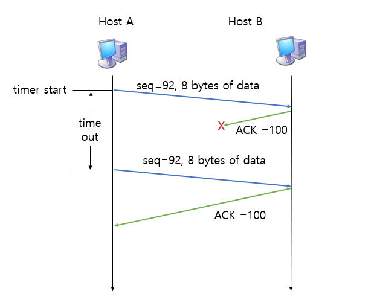
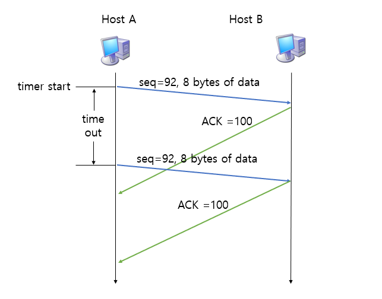
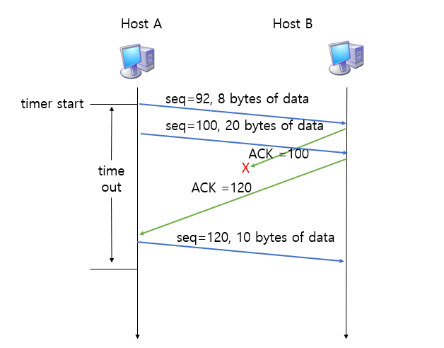
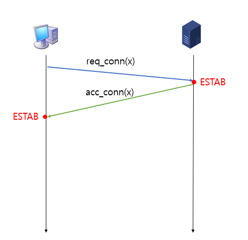
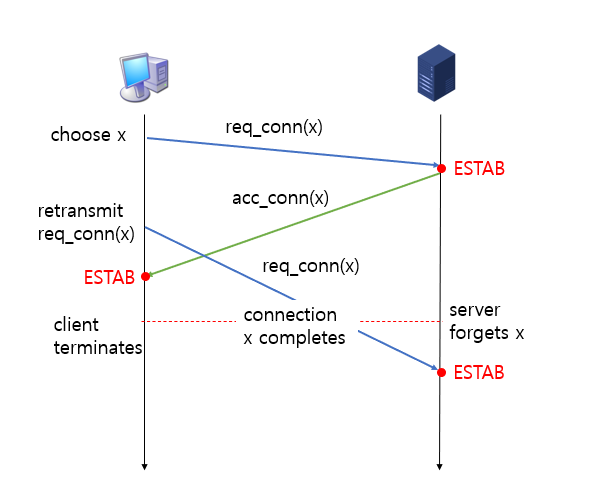
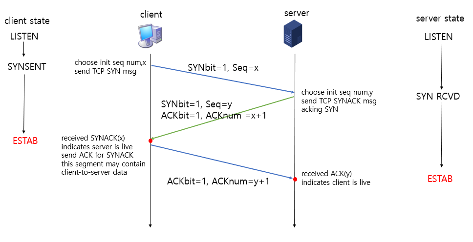

# TCP (Transmission Control Protocol)
> 애플리케이션에서 보낸 데이터를 신뢰성 있게 수신 측에 전송을 보장하는 프로토콜
## 특징
- point-to-point : 하나의 송신 측과 하나의 수신 측이 통신하는 1:1 통신이다.
- reliable : 신뢰성 있는 데이터 전송을 보장한다.
- pipelined : TCP 흐름 제어와 혼잡 제어가 window size를 설정한다.
- full duplex (전이중 통신) : 쌍방향 통신이 가능하다. 즉 데이터를 주고받을 수 있다.
- connection-oriented : 연결 지향적이다. 송신 측과 수신 측이 데이터를 교환하기 전에 handshaking을 한다.
- flow control : 흐름 제어를 한다.
- congestion control : 혼잡 제어를 한다.

## TCP RDT(Reliable Data Transfer)
> [RDT](www.naver.com)는 신뢰성 있는 데이터의 전송을 의미한다.

- TCP는 다음과 같은 항목들을 이용하여 RDT를 구현한다.  
    
    `pipelined segments`
    `cumulative acks`
    `single retransmission timer`
    
- 또한 데이터의 재전송은 다음을 통해 이루어진다.  

    `timeout events(timeout 발생 시)`
    `duplicate acks(중복 ACKs)`
    
## TCP 데이터 재전송 시나리오
- duplicate acks와 흐름 제어, 혼잡 제어는 없다고 가정하자.

### 데이터 교환 도중 ACK가 손실됐을 때의 시나리오

- Host A가 데이터를 보내면 timer가 시작된다.
- Host B는 데이터를 받고 ACK를 보낸다. 해당 ACK는 전송 도중 손실된다.
- timer가 timeout되면 해당 데이터를 재전송한다.

### 데이터 교환 도중 ACK 신호가 timeout 되고 나서 도착하는 경우의 시나리오

- Host A는 seq number가 92인 8 byte 데이터를 보냈다.
- Host B는 데이터를 성공적으로 수신해 ACK 100 신호를 보냈다.
- 그러나, ACK 100 신호가 오기 전에 timer가 timeout 되어 seq number 92인 데이터를 재전송했다.
- 위와 같은 경우에는 데이터가 문제 없이 도착했고 ACK 신호도 손실 없이 전송됐지만 데이터를 재전송을 하게 되는 경우이다. 
- 이같은 문제는 timer의 timeout 시간을 너무 짧게 설정했기 때문에 발생한다. 따라서 적절한 timeout을 설정하는 것이 중요하다. 

### ACK 하나가 중간에 손실되고 가장 최근의 ACK은 문제없이 전송됐을 때의 시나리오

- Host A는 seq 92와 seq 100 데이터를 보냈다. 
- Host B는 두 데이터 모두 성공적으로 수신했고 ACK 100과 ACK 120을 보냈다.
- ACK 100은 전송 도중 손실됐고, ACK 120은 문제없이 전송됐다.
- Host A는 ACK 100 신호가 오지 않았지만 ACK 120을 수신했으므로 seq 120 데이터를 보낸다.
- seq 92 데이터에 대한 timer가 timeout 되어도 데이터를 재전송하지 않는다. ACK 120을 받은 것으로 그 전 데이터도 문제없이 전송됐다는 사실을 알 수 있기 때문이다. 

## TCP 3-way handshake
> 데이터를 교환하기 전 서로 연결하는 것에 동의하는 것을 __handshake__ 라고 한다.

### 2-way handshake

- 클라이언트가 서버에게 연결을 요청하면 서버에서 이를 받아들이고, 연결을 만든 후 연결을 받아들인다는 신호를 클라이언트에 보낸다.
- 그러고 난 뒤 클라이언트에서도 연결을 만든다.

#### 문제점

    `variable delays`
    `retransmitted messages due to message loss` 
    `message reordering`
    `can't see other side`
    
- 2-way-handshake가 실패하는 한 가지 사례만 알아보자.

### half-open connection

- 위 그림과 같이 ACK가 오기 전에 요청을 재전송하게 되는 경우에는 서버만 ESTAB 되고 클라이언트는 ESTAB 되지 않는 half-open connection 문제가 발생할 수 있다.
- 이러한 문제점을 해결할 수 있는 방식이 3-way-handshake이다.

### 3-way handshake

#### Step 1
- 클라이언트가 서버에 접속을 요청하는 SYN 패킷을 보낸다.
- 클라이언트는 SYN을 보내고 SYN/ACK 응답을 기다리는 SYNSENT 상태, 서버는 LISTEN 상태다.
#### Step 2
- 서버는 SYN 요청을 받고 클라이언트에게 요청을 수락한다는 ACK와 SYN 패킷을 보낸다.
- 서버는 ACK을 기다리고 SYN RCVD 상태가 된다.
#### Step 3
- 클라이언트는 ACK과 SYN 패킷을 받고 연결이 ESTAB 된다.
- 클라이언트는 SYN/ACK을 잘 받았으므로 ACK을 보낸다.
- 서버는 ACK을 받고 연결을 ESTAB 한다. 

