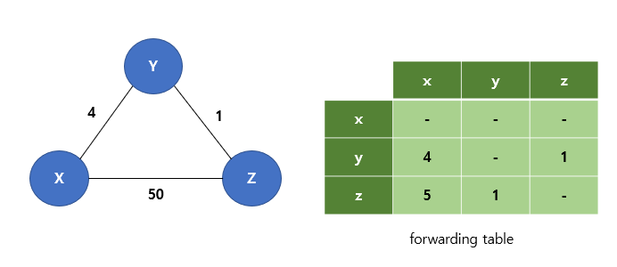
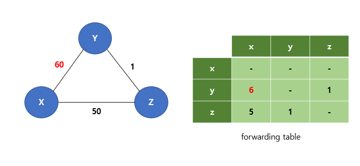
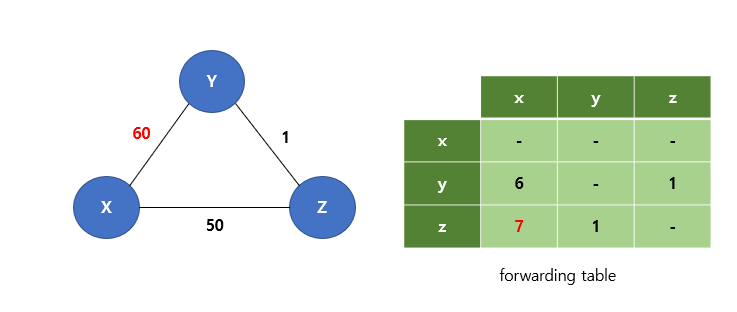
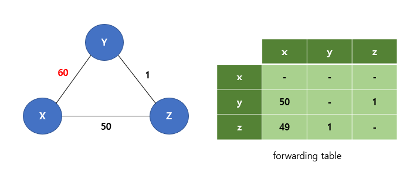
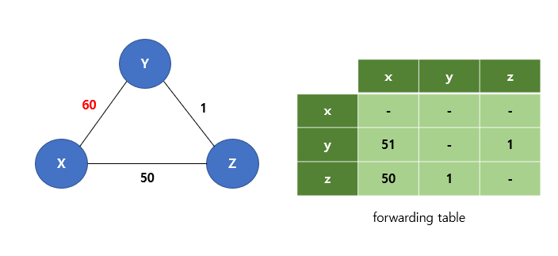
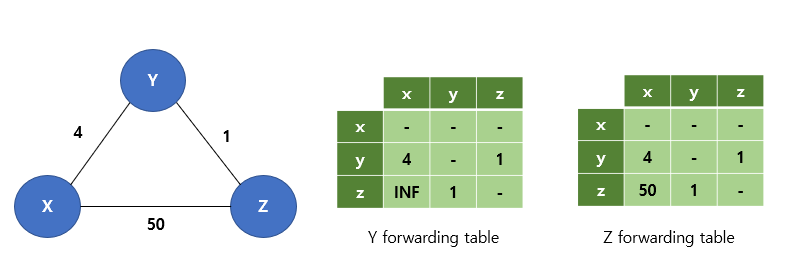
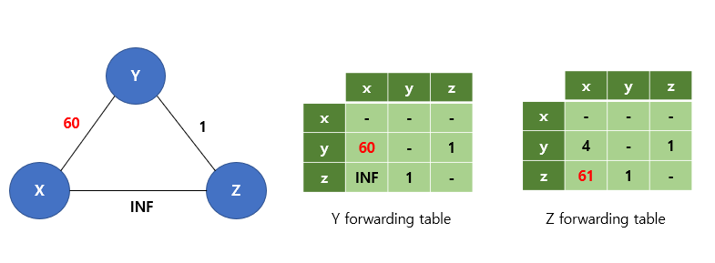

# 라우팅 알고리즘

## 정의
- 송신 측에서부터 수신 측 라우터의 네트워크를 통과하는 최적의 경로를 결정하는 알고리즘이다.

## 분류
### 중앙 집중형 라우팅 알고리즘(Global)
- 네트워크 전체에 대한 완전한 정보를 가지고 출발지와 목적지 사이의 최소 비용 경로를 계산한다. 즉, 모든 라우터가 연결 상태와 링크 비용을 알고 있다는 것이다. 
- Link State 알고리즘이 여기에 속하며 주로 다익스트라 알고리즘을 사용한다.

### 분산 라우팅 알고리즘(Decentralized)
- 최소 비용 경로의 계산이 라우터들에 의해 반복적이고 분산된 방식으로 수행된다. 
- 어떤 라우터도 모든 링크 비용에 대한 완전한 정보를 갖고 있지 않지만, 각 라우터는 자신에게 연결된 인접 노드에 대한 링크 비용 정보를 알고 있다. 
- 이후 반복된 계산과 인접 노드와의 정보 교환을 통해 목적지까지의 최소 비용 경로를 계산한다. 
- Distance Vector 알고리즘이 여기 속하며 주로 벨만-포드 알고리즘을 사용한다.

---
### 정적 라우팅 알고리즘 
- 경로의 변경이 느리고 사람이 직접 링크에 대한 비용을 수정해야 한다. 
- 규모가 큰 네트워크에서 일일이 수정하기 불가능하며 사람이 하기에 역부족이다.
### 동적 라우팅 알고리즘 
- 네트워크 트래픽 부하나 topology 변화에 따라 라우터가 자체적으로 경로를 바꾼다. 
- 동적 알고리즘은 주기적으로 topology나 링크 비용의 변경에 직접적으로 응답하는 방식으로 수행된다. 
- 동적 알고리즘은 네트워크 변화에 더 빠르게 대응할 수 있지만 경로의 loop나 경로 진동과 같은 문제에 취약하다.


## Link State 알고리즘
- 중앙 집중형 알고리즘에 속한다. 
- 즉, 모든 라우터(노드)가 모든 링크(간선)의 비용을 알고 있기 때문에 다익스트라 알고리즘을 이용해 최적의 경로를 계산할 수 있다. 
- 한 노드(source node)에서 다른 모든 노드까지의 최적경로를 계산해 Routing Table에 저장해 놓는다.

### 예시
<p align="center"></p>

<p align="center"></p>

- 위와 같은 네트워크 상황이 있다고 가정하자.
- 시작점을 u로 두고, u 노드에서 갈 수 있는 노드들의 값들을 계산해보면 [표 1] step1 행의 값들과 같다. 이 중에서 가장 cost가 적은, w 노드로 가는 길이 처음으로 선택될 것이다.
- 다음으로, w 노드로 가는 길이 선택됨과 동시에, 다시 u 노드에서 갈 수 있는 노드들의 값들을 계산해보면, [표 1]의 step2 행의 값들과 같다.
- 이 때, u에서 v로 가는 경로의 cost의 경우, 직접 가는 길과 이미 알려진 w를 거쳐 가는 길 중 cost가 적은 값을 기준으로 다시 업데이트 된 것을 확인할 수 있다. (cost 7 -> cost 6)
- 결국 step2 에서는 가장 cost가 적은 x 노드로 가는 길이 선택될 것이다.
- 이런 과정으로 계속해서 진행하면 [표 1]과 같은 값들이 나올 것이고, 이를 통해 만들어진 그래프는 아래 [그림 2]와 같다.

<p align="center"></p>

## Distance Vector 알고리즘
- 분산형 알고리즘에 속한다. 
- 즉, 각 노드는 자신에게 연결된 이웃의 링크의 비용만 알고 있기 때문에 벨만-포드 알고리즘을 이용해 최적의 경로를 계산할 수 있다. 
- DV 알고리즘은 반복적이고 비 동적이며 분산적이다. 이웃끼리 반복해서 정보를 교환해 최적의 경로를 갱신하는 식이다.

### 예시
<p align="center"></p>

- [그림 3]과 같은 네트워크 상황이 있다고 가정하자.
- u 노드에서 z 노드로 가는 최단 경로를 찾고싶다고 할 때,
```
step 1. 우선, Dv(z) = 5, Dx(z) = 3, Dw(z) = 3 임을 계산한다. (Dx(y)는 x에서 y까지의 최단경로)
step 2. Du(z)를 아래 식을 이용해 계산한다.
```

<p align="center"></p>

- 하지만 여기서 의문인 것은, step 1의 Dv(z), Dx(z), Dw(z)의 값들은 어떻게 구하냐는 것이다.
- Bellman-Ford 알고리즘은 기본적으로 Distance Vector 알고리즘이므로, 해당 값들은 그냥 이미 알고 있는다고 가정하고 진행하기 때문에 u 노드 입장에서는 이를 전혀 신경쓰지 않는다.
- Dv(z)의 경우, v 노드에서 위의 step1, 2 과정을 거쳐 나온 결과가 5인 것이며, u 노드는 이 정보를 이용할 뿐, 구체적으로 어떤 과정을 통해 해당 값이 나왔는지는 고려하지 않는다.


### Count to infinity 문제
<p align="center"></p>

- Distance Vector 알고리즘은 다른 라우터로 가는 최적 경로를 forwarding table에 저장해놓는다. 
- 위와 같은 상황에서 Y에서 X로 가는 비용이 60으로 증가한다면 어떻게 될까? (이해를 쉽게하기 위해 X 라우터의 forwarding 정보는 무시하자)
<p align="center"></p>

- Y라우터는 인접 라우터들에 자신이 X로 가는 비용이 60으로 증가했음을 알리고, 최적 경로를 다시 계산하게 된다. 
- 이 때, Y라우터는 Z로부터 X라우터 까지 가는데 5의 비용이 든다는 정보를 얻게 된다. 
- 오직 주변 노드의 정보로만 경로를 판단하기에 Y는 Z 노드까지만 가면 어떻게든 Z에서 X까지 5의 비용으로 갈 수 있다고 생각해 Y에서 Z를 가는 비용 1을 더해 X 노드까지 6의 비용으로 갈 수 있다고 생각하게 된다.
<p align="center"></p>

- 이후 Z 노드는 Y 노드까지만 가면 Y에서 알아서 X까지 6의 비용으로 간다고 판단한다. 
- 따라서 Z에서 Y 노드 가는 비용 1을 더해 7의 비용이면 X 노드까지 갈 수 있을 거라고 생각하게 된다. 즉 X로 가는 비용을 7로 변경한다.
<p align="center"></p>

- 이후 Y는 X로 가는 비용을 8로 변경, Z는 X로 가는 비용을 9로 변경.... 이렇게 낭비적인 연산을 44번 반복하고 나면 Y에서 X를 가는데 50이 든다고 생각하게 된다. 
- 이 때 드디어 Z는 Y를 통해 가면 50+1=51의 비용이 든다고 생각해 Y를 통해서가 아닌 바로 X로 가는 비용 50이 더 최적이라고 판단하게 된다. 
<p align="center"></p>

- 이후 Y 노드도 정상적으로 Z를 통해 X를 가면 51의 비용으로 최적 경로라는 것을 알게 된다.

### 해결 (Poisoned Reverse)
<p align="center"></p>

- 만약 Z 노드에서 Y를 통해 X를 가는게 최적 경로라면, Z 노드가 Y 노드에게 자신은 X 노드로 가는 비용이 무한대라고 전하는 방식이 Poisoned Reverse이다.
- 이렇게 하면 2번의 iteration이면 최적 경로를 제대로 갱신할 수 있다. 마찬가지로 Y에서 X로 가는 비용이 60으로 늘어났다고 하자.
<p align="center"></p>

- Y노드는 Z노드를 통해 X를 가면 무한대의 비용이 든다고 생각해 바로 X노드로 가는 60이 최적 경로라고 판단하고 갱신한다. 
- Z노드는 Y를 통해 X를 가면 61의 비용이 든다고 생각해 갱신한다.
