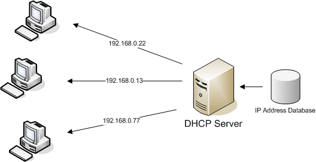
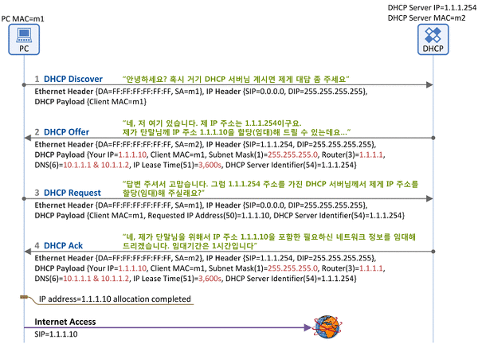

# DHCP (Dynamic Host Configuration Protocol, 동적 호스트 구성 프로토콜)
## 정의
- TCP/IP 프로토콜에서 인터넷으로 다른 컴퓨터와 연결하기 위해서는 연결하고 싶은 컴퓨터의 주소를 알아야한다. 
- 여기서 쓰이는 주소가 바로 IP 주소인데, 이 IP 주소를 관리하기 위한 일종의 규약이 DHCP 이다.
- 우리가 인터넷에 접속할 때 DHCP 서버에 쓸 수 있는 IP 주소를 요청하고 DHCP 서버는 이 요청을 받아들여 IP 주소를 정해진 시간동안 우리에게 할당해주는 식이다. 
- 또한, 시간이 지나면 DHCP 서버에게 다시 IP주소 사용 연장 요청을 해야 한다.
- 왜 DHCP를 쓰는 것일까? IP 자원은 한정되어 있으므로 중앙에서 이를 관리하면서 안쓰는 자원은 빨리빨리 회수를 할 수 있는 것이다. 또한, 중앙에서 관리하기 때문에 서로 다른 PC가 같은 IP를 쓸 일도 없다. 즉, 충돌문제도 예방할 수 있다.

## 구조

- 특정 네트워크 영역에서 DHCP 클라이언트들이 IP 주소를 요청하고, DHCP 서버는 요청을 받아서 IP 주소를 할당해주는 식이다. 
- 이와 함께, 클라이언트의 TCP/IP 설정이 초기화되고 다른 PC와 통신을 할 수 있게되는 것이다.

### 의문점
#### Q) IP 주소가 없다면 통신이 불가하다. 그렇다면 Client는 맨 처음에 DHCP 서버에 어떻게 요청을 보낼까?
#### A) 브로드캐스트!!
- 같은 네트워크 영역(서브넷)에 있는 모든 PC들에게 요청을 보내는 것이다. "저는 A 라는 클라이언트 인데요, 이 편지를 받는분중에 DHCP 서버님이 계신다면 저에게 답장을 좀 주세요!"라는 메세지를 적어서 사방에 뿌리는 것이다. 
- 그렇게 되면 DHCP 서버는 해당 메세지를 보낸 클라이언트에게 IP를 할당해주는 것이다. 
- 이렇게 브로드캐스트를 사용하려면 기본적으로 빠른 통신 속도가 필요한데, 이러한 이때문에 DHCP는 UDP 프로토콜을 기반으로 작동한다.

## 원리
- DHCP 서버는 정해진 시간동안만 IP 주소를 할당해주고, 그 다음에 DHCP 서버에 갱신 요청을 한다면 IP 주소를 계속 쓸 수 있다.
- 물론, IP가 더 이상 필요 없어지면 IP 주소를 반납할 수 있다.

## 절차

### 1. DHCP Server Discovery
- 클라이언트는 처음에 DHCP 서버의 주소를 모른다. 때문에 서브넷 내 모두에게 DHCP 서버를 찾는 메세지를 브로드캐스팅한다.

### 2. DHCP Server Offer
- DHCP가 브로드캐스트 메세지를 받으면 클라이언트에게 서버 자신의 IP 주소를 알려준다. 
- 이와 함께 클라이언트가 사용할 IP 주소, DNS 정보, IP 주소의 사용 시간(Lease Time)을 전달한다. 
- 그런데, 이 DHCP 서버 또한 클라이언트의 주소를 알지 못하여 메세지를 보낼 수 없다.(아직 IP 주소 할당이 안됐다!) 
- 그렇기 때문에 마찬가지로 브로드캐스팅하여 이 정보를 사방으로 뿌린다. 

### 3. DHCP Request
- 클라이언트는 서버로부터 응답을 전해받는다. 그런데, 응답을 전해온 DHCP가 여럿일 수 있다. 
- 그 경우 클라이언트는 이제 갑의 위치에 올라서 자신에게 가장 유리한 최적 서버를 선택하고, 해당 서버에 DHCP 요청 메세지를 보낸다.

### 4. DHCP ACK
- 메세지를 받은 서버는 "그럼 우리 이 계약을 확정하자" 라는 의미로 ACK 메세지를 클라이언트에게 보낸다.
