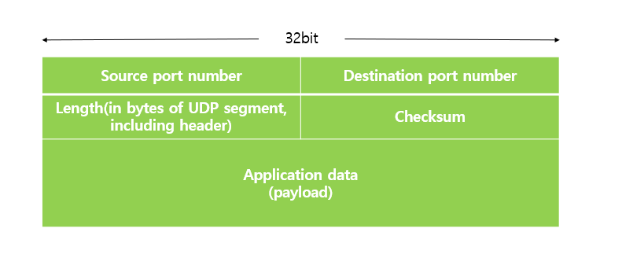
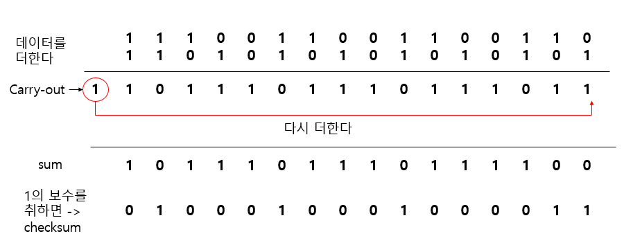

# UDP (User Datagram Protocol)
## 정의
- UDP(User Datagram Protocol)는 비연결형, 신뢰성이 없는 전송 프로토콜이다.
- IP 데이터그램을 캡슐화하여 보내는 방법과 연결 설정을 하지 않고 보내는 방법을 제공한다.
- UDP는 TCP/IP 5계층에서 Transport Layer(전송계층)의 프로토콜이다.

## 특징
- UDP는 흐름제어, 오류제어 또는 손상된 세그먼트의 수신에 대한 재전송을 하지 않는다. 
- 따라서, 내용이 전송 중에 손실될 수 있고, 전송되는 세그먼트의 순서가 바뀔 수 있다.
- UDP는 TCP보다 간단하고 빠르다.
- 작은 header size를 가지고 있다.
- 흐름제어를 하지 않기 때문에 전송 속도를 최대한 빠르게 할 수 있다.
- 수신자와 송신자 간의 handshaking이 없는 connectionless 성질을 가진다.

## UDP Checksum
> UDP segment header에 있는 요소로써, 전송된 segment의 에러를 탐지하기 위한 것이다.

### 계산 과정
- 도착 IP 주소, 송신 포트번호, 수신 포트번호, 데이터 길이, payload 등의 데이터들을 16 비트 단위로 쪼개서 전부 더한다.
- 만약 더하는 도중 overflow 돼서 carry-out된 값이 있다면 결과에 다시 더해서 sum 값을 만든다.
- 계산한 sum 값에 1의 보수를 취하면 checksum 값이 된다.
- 이렇게 계산한 checksum 값을 송신측에서 checksum 영역에 넣어서 수신측에 보내면 수신측도 마찬가지로 sum값을 구하고, checksum 값을 구해서 송신측에서 보낸 checksum 과 동일한지 확인한다. 
- 만약 동일하다면 에러가 없는 것이고 동일하지 않다면 에러가 있다는 것을 확인 할 수 있다.
- 결함이 있는 부분은, 전송 도중 checksum 값이 바뀔 수도 있고 데이터가 변형되었음에도 불구하고 checksum 값이 동일한 경우도 발생할 수 있다. 

### 예시

- 위 그림은 checksum을 계산하는 방법의 예시다. 예를 들기 위해 데이터를 2개만 있다고 가정하고 진행했다. 
- 데이터를 모두 더하고 carry-out이 발생했으므로 그 값을 다시 더해주면 sum 값이 나오고, 이 sum 값을 1의 보수를 취하면 checksum이 된다.

## DNS가 UDP를 사용하는 이유
### 빠른 속도
- TCP의 경우 데이터 전송 시작 전에 3-way-handshaking 과정이 있는 반면 UDP는 연결 설정에 드는 비용이 없다. 
- DNS는 신뢰성보다 속도가 더 중요한 서비스이기 때문에 TCP보다 UDP가 더 적합하다.
- 또한, UDP는 512 bytes를 넘어가지 않는 패킷만 전송이 가능하고 오버헤드가 없어서 속도가 빠른데, DNS가 전송하는 데이터 패킷 사이즈가 매우 작으므로 UDP가 유리하다.
- 이 때 단순히 패킷의 사이즈가 작다고 DNS가 UDP를 채택한 것은 아니고, 전달하는 패킷의 크기가 작기 때문에 신뢰성이 보장되지 않아도 되기 때문이다. (못 받으면 다시 전달하면 된다.)

### 연결 상태를 유지할 필요가 없다.
- TCP는 호스트 간의 연결 상태를 유지한다. 
- 이 때, TCP의 패킷 안에는 여러 정보가 담겨 있지만, UDP는 어떤 정보도 기록하지 않고 유지할 필요도 없다. 
- 따라서 DNS 서버는 TCP보다 많은 클라이언트를 수용할 수 있으므로 연결 상태를 유지하지 않고 정보 기록을 최소화할 수 있는 UDP를 채택하였다.
